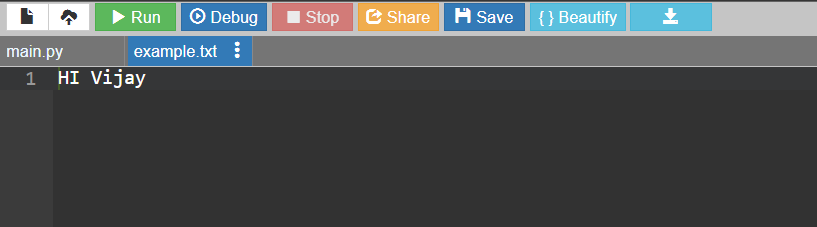
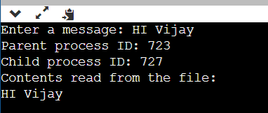

# EX.7-IMPLEMENTATION-OF-SYSTEM-CALLS-READ-WRITE-FORK-OPEN-CLOSE

### AIM:
To implement and demonstrate the usage of several fundamental system calls.

### ALGORITHM:
#### Step 1 :
Import the os module for working with processes.

#### Step 2 :
Prompt the user to enter a message and store the input in the variable user_input.

#### Step 3 :
Open a file named "example.txt" in write mode ("w") and use a context manager (with) to ensure the file is properly closed after writing.

#### Step 4 :
Write the user's input (user_input) to the file.

#### Step 5 :
Fork a child process using the os.fork() function. The child process will have a new process ID (PID).

#### Step 6 :
In the parent process: 1. Print the parent process ID using os.getpid(). 2. Open "example.txt" in read mode ("r") using a context manager and store its contents in the variable file_contents. 3. Print "Contents read from the file:" followed by the file_contents.

#### Step 7:
In the child process: 1. Print the child process ID using os.getpid(). 2. Exit the child process.
### PROGRAM:
~~~
import os

user_input = input("Enter a message: ")

with open("example.txt", "w") as file:
    file.write(user_input)

child_pid = os.fork()

if child_pid == 0:
    print("Child process ID:", os.getpid())
    exit()
else:
    print("Parent process ID:", os.getpid())

    with open("example.txt", "r") as file:
        file_contents = file.read()

    print("Contents read from the file:")
    print(file_contents)
~~~
### OUTPUT:

### RESULT:
The expected output of the program should demonstrate successful file write and read operations, and it should indicate the creation of a child process.
